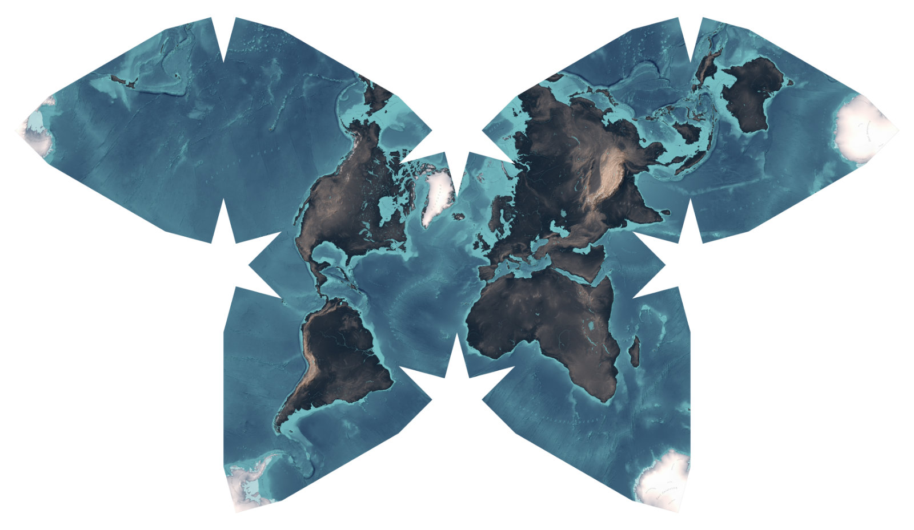

# Haacker

A library of scripts to generate static maps using open source technology.

## Background

### Purpose
This library was originally developed to support the design process of a printed butterfly map. You can find out more about the map itself in the related detailed [documentation](https://interface.fh-potsdam.de/butterfly/).

### Naming
The library is named after [Hermann Haack](https://de.wikipedia.org/wiki/Hermann_Haack_(Kartograf)), a german cartographer.

## Installation

Install the requirements by running `npm install` in the root directory.

### Additional Requirements

If you want to process the ETOPO1 data, make sure that [GDAL](https://www.gdal.org/) is installed on your machine.

## Included tools

### ETOPO1 Data Processing (`process-etopo1-data`)

_TLDR: A Shell script that downloads and prepares the elevation data for the mapping process. Delivers a set of GeoJSONs for different elevation levels. Run it with `npm run process-etopo1-data` in the root directory._

If a map should contain elevation levels, data from a digital elevation model (DEM) is needed. The NOAA provides such a model in the GeoTIFF format. This file can be processed to a series of GeoJSONs that can be used by D3 to generate a map.

This shell script automatically downloads the GeoTIFF dataset and converts it to GeoJSON files. The script can be called with the command `npm run process-etopo1-data` in the root directory. By default, it generates GeoJSONs for each hundred meter level, starting from -10,000 meters (sea ground) to 9,000 meters (Himalaya). The resulting files are therefore:

- `-10000.geojson` (lowest sea level)
- `-9900.geojson`
- `many more sea level files…`
- `-100.geojson`
- `0.geojson` (first landmass file)
- `100.GeoJSON`
- `many more landmass files…`
- `9000.GeoJSON`

These settings can be tweaked in the section `your settings` in the file `process-etopo1-data/main.sh`.

**Attention: Depending on the settings and your machine, this script might take several hours to run!**

### Map Layer Generation (`render-map-layer`)
_A node application that renders a map layer for given GeoJSON data. Uses d3 and it's projections._

The map generation is controlled with a config file, see the file `config.example.js` as an example. The config file sets the map’s dimensions and layers.

#### Layer types

The tool supports these layer types:

- `filled` — a filled layer, consisting of a a single GeoJSON
- `stroked` — an outlined layer, consisting of a a single GeoJSON
- `levels` — a series of filled levels, consisting of a set of GeoJSONs

Please see the `config.example.js` for a reference how to use these layers. The config files need to be placed in the folder `render-map-layer`.
To run the script, use the command `npm run render-map-layer` in the root directory. By default, the script will look for a `config.js` file in the folder `render-map-layer`. If you want to use another file, provide it's name as a argument like this: `npm run render-map-layer my.special.config`.

### Map Label Generation (`render-map-label`)
_A node application that renders map labels as SVG for given GeoJSON data._

This works similar to the `render-map-layer` script. It also uses a `config.js` file. To run the script, use the command `npm run render-map-label` in the root directory.

The script outputs SVG files with labels and dots in the desired projection. It was only tested and is optimized for files from [Natural Earth](http://naturalearthdata.com).

### Map Cutline Generation (`render-map-cutline`)
_A node application that creates a cutline as SVG for a map._

This works similar to the `render-map-layer` script. It also uses a `config.js` file. To run the script, use the command `npm run render-map-cutline` in the root directory.

## Central folders

By default, the tools use a common data folder at `data`. Exported maps are saved in the folder `export`.
Also, a folder called `temp` is used in the root directory for temporary files.
